# 기말고사
## 데이터 베이스

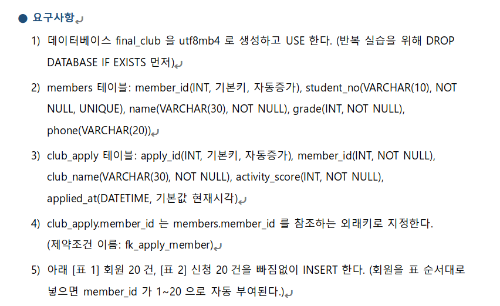

**DROP DATABASE IF EXISRTS**
명령어를 통해 데이터베이스 중복을 방지하여 삭제하고 
**CREATE** 명령어를 이용하여 
**FINAL_CLUB**이라는 데이터 베이스를 만들었다

위에 데이터 베이스 목록에 있는걸 알수있다

**MEMBERS** 와 **CLUB_APPLY** 테이블을 만들고
각각 테이블의 
**(요구사항 2,3,4번)**
을 만족시킨걸 볼수있다.

각각 테이블의 맞는 값을 **INSERT** 해주며 
**(요구사항 5번)**
을 만족시키는 명단을 만들었다

## 문제 2번

**SELECT** 를 이용하여 STUDENT_NO에서 2026021이 
없는걸 알수있다

**(요구사항 6)**
김하늘의 값을 만들어주고 다시 찾아보면 만들어진걸 볼수있다

**(요구사항 7)**

이서연의 변경 전 데이터를 확인한다.

**UPDATE**의 명령어를 통하여 이서연의 데이터가 바뀐걸 볼수있다

**(요구사항 8)**

**SELECT**로 삭제전 밴드의 김민준이 들어가있는걸 볼수있다

데이터 베이스 삭제는 **DROP**이며
테이블 값을 삭제할때는 **DELETE**를 사용한다
밴드에 김민준이 삭제된걸 볼수있다

**(요구사항 9)**

**(요구사항 10)**

첫번째 사진처럼 하면 오류가 나타는걸 볼수있다
이름을 찾을려면 =가 아닌 LIKE를 사용하고
'김'으로만 찾으면 이름이 '김'을 찾는다는 소리고
'김@@'을 찾을려면 '김'뒤에 %를 넣어줘야한다

**(요구사항 11)**

**AND** 는 두개 다 만족하는걸 찾고 
1,3학년들만 찾을려면

**OR**을 넣어줘야한다

문제에 나오는 **IN**을 사용해서도 찾을수있다

**(요구사항 12)**

**BETWEEN**을 사용해 80점과 100점 사이 값을 찾는다

**(요구사항 13)**

**AND**를 사용해 코딩과 90점을 동시에 가지는 값을 찾는다

**(요구사항 14)**

**(요구사항 15)**

**(요구사항 16)**

**(요구사항 17)**

**(요구사항 18)**

**(요구사항 19)**

**(요구사항 20)**

**(요구사항 21)**

오름차순은 ASC

**(요구사항 22)**
**WHERE**은 그룹화 하기 전에 조건을 걸고
**HAVING**은 그룹화 후에 조건을 거는것이다

**(요구사항 23)**

**(요구사항 24)**

**(요구사항 25)**

**(요구사항 26)**

**(요구사항 27)**

원본 테이블의 구조를 숨기고 사용자가 꼭 필요로 하는 데이터만 제한적으로 보여줌으로써 여기선 핸드폰 번호를 숨기고 보여줄수있다

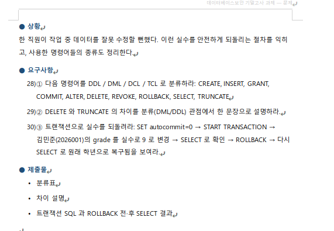

**(요구사항 28)**
| 명령어 종류 | 설명                                                                                           | 해당 명령어                 |
| :---------- | :--------------------------------------------------------------------------------------------- | :-------------------------- |
| **DDL**     | 데이터베이스 구조나 객체를 정의, 변경, 삭제할 때 사용한다.                                     | `CREATE` `ALTER` `TRUNCATE` |
| **DML**     | 테이블 내의 데이터를 조회, 삽입, 수정, 삭제할 때 사용한다.                                     | `SELECT` `INSERT` `DELETE`  |
| **DCL**     | 데이터베이스에 대한 접근 권한을 관리자 권한으로 사용자에게 부여하거나 회수할 때 사용한다.      | `GRANT` `REVOKE`            |
| **TCL**     | DML 명령어로 작업한 트랜잭션의 결과를 최종적으로 데이터베이스에 반영하거나 취소할 때 사용한다. | `COMMIT` `ROLLBACK`         |

**(요구사항 29)**
**DELETE**는 **DML**로서 **ROLLBACK**이 가능한 하고 
TRUNCATE는 DDL로서 테이블을 완전히 초기화하여 모든 행을 한 번에 
삭제하고 자동으로 **COMMIT**되므로 **ROLLBACK**이 불가능하다

**(요구사항 30)**
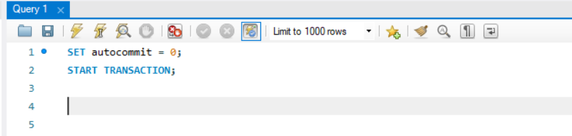
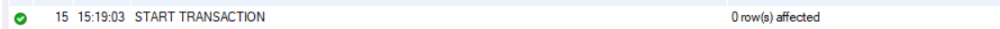

트렌젝션 시작

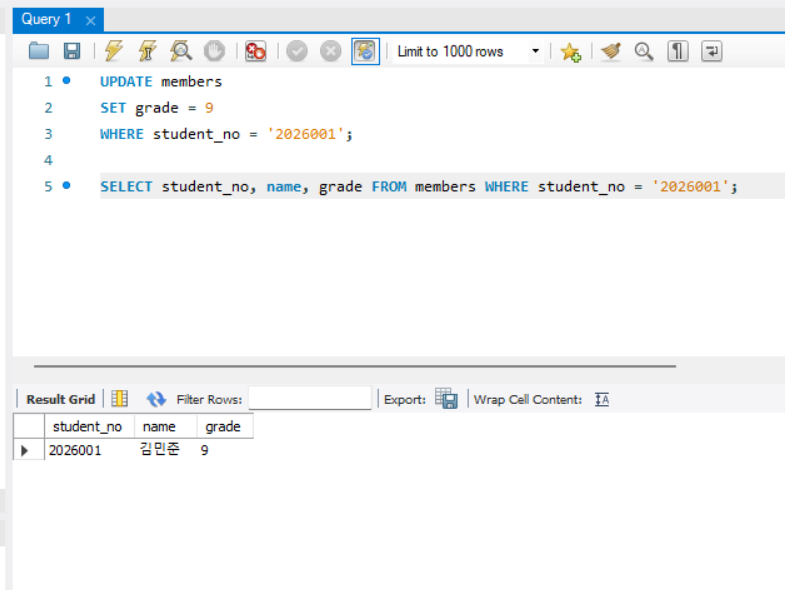
실수로 '김민준'의 학년을 9로 변경

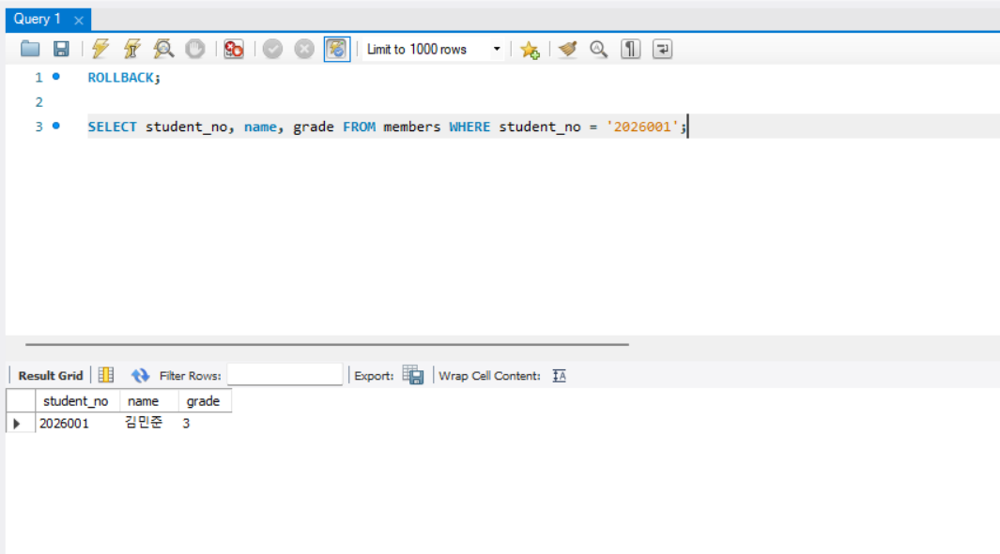
롤백하여 다시 돌아온걸 볼수있다.

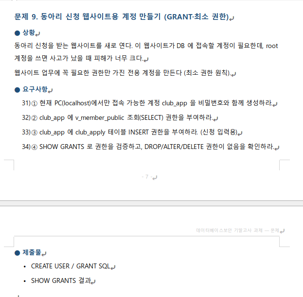

**(요구사항 31)**
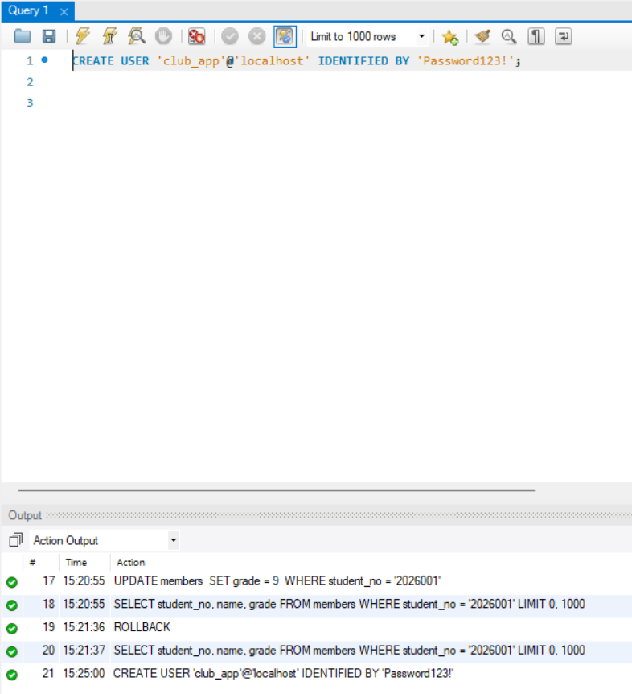
계정 생성

**(요구사항 32)**
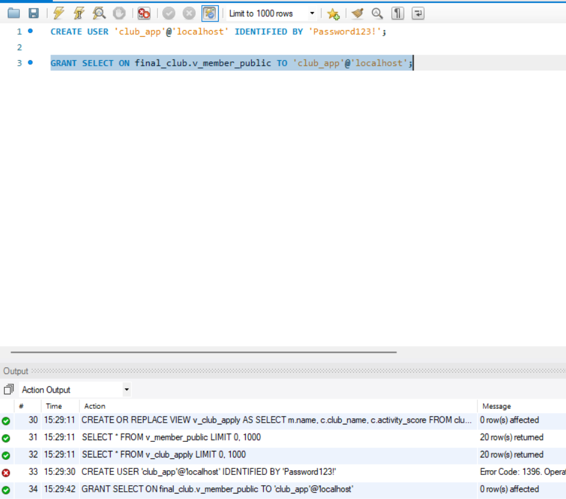
조회 권한 부여

**(요구사항 33)**
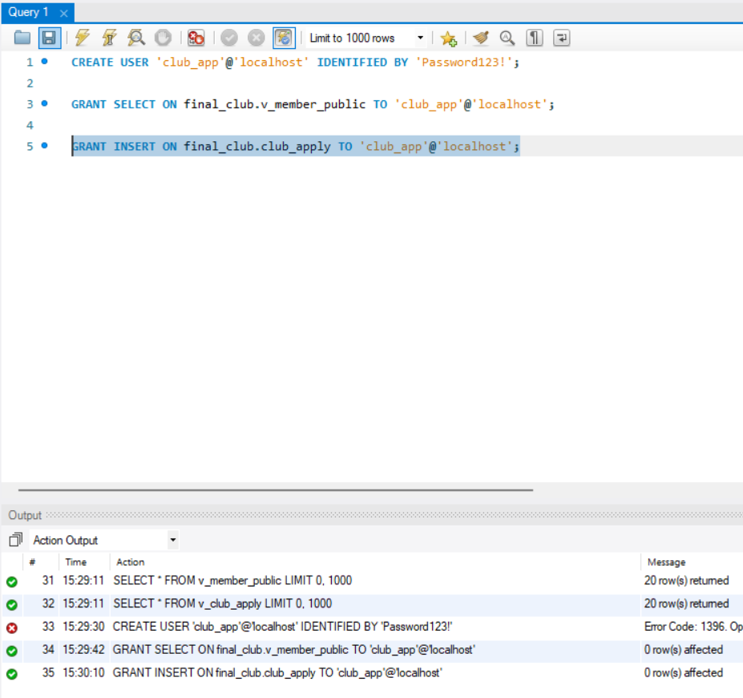
삽입 권한 부여

**(요구사항 34)**
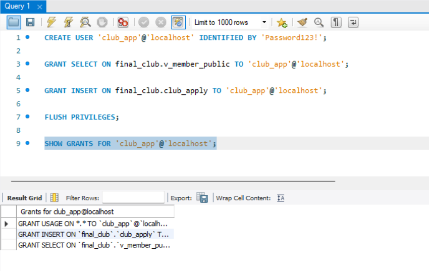
권한 확인

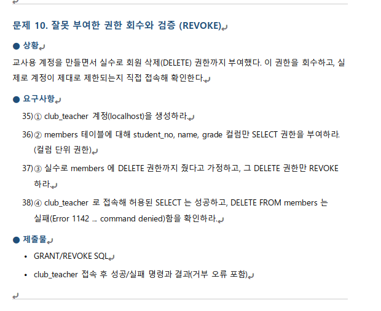

**(요구사항 35)**
  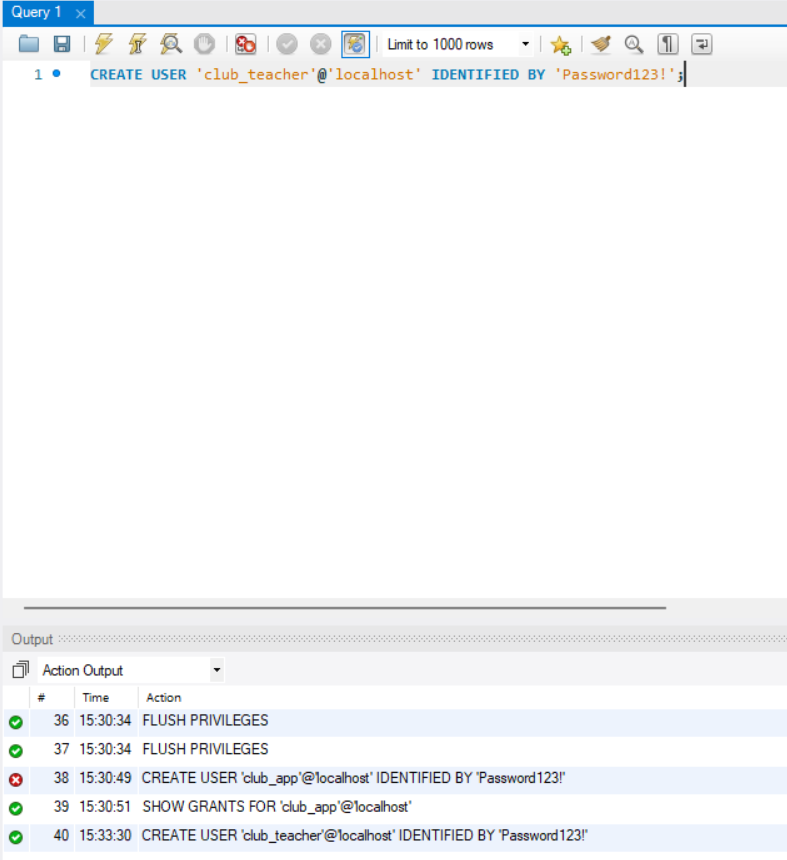
계정 생성

**(요구사항 36)**
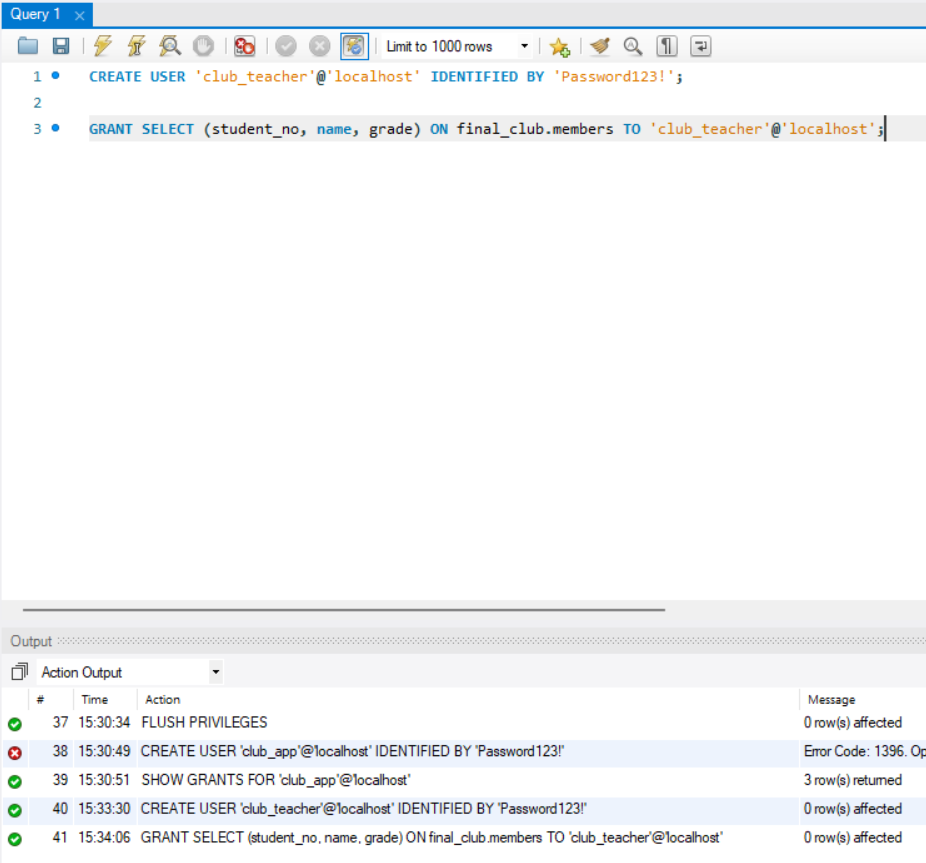
SELECT 권한 부여

**(요구사항 37)**
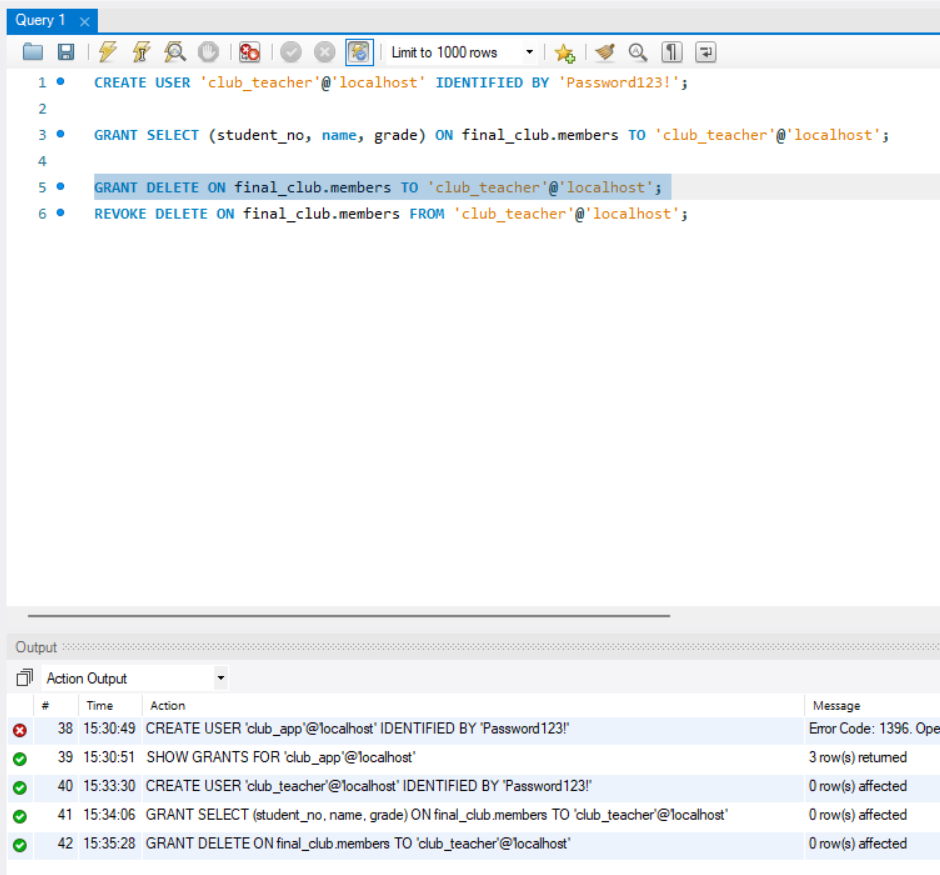
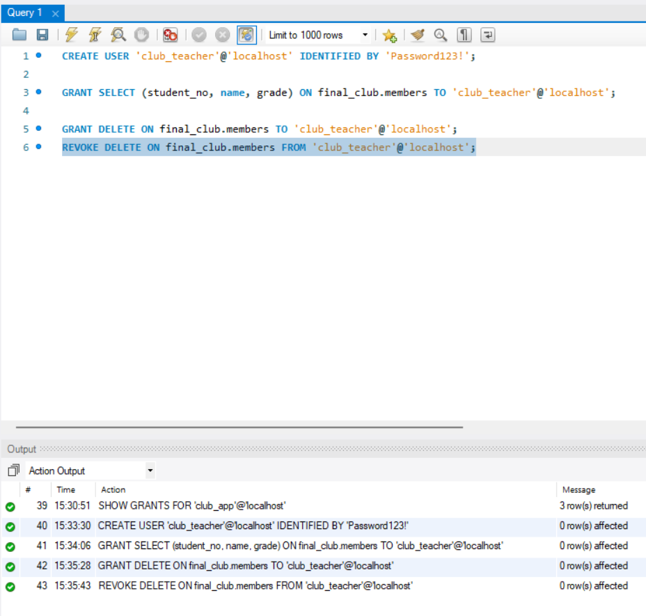
실수로 DELETE 권한 부여하여 다시 뻇음

**(요구사항 38)**

SELECT 성공
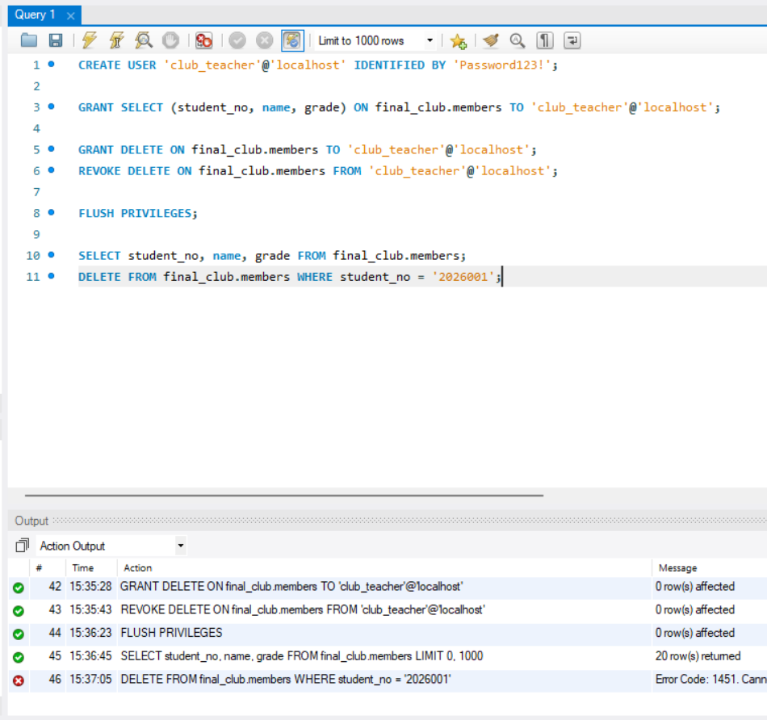
DELETE 실패