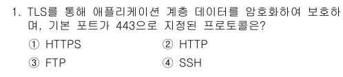

**정답 : 1번** 
HTTPS 는 443번
HTTP 는 80번 
FTP 는 20(데이터)21(제어) 번
SSH 는 22 번 포트를 사용한다

**정답 : 2번**

  규칙 
- 앞에 0이 있으면 생략 가능
- 0000:0000 으로 이루어진건 :: 으로 가능

**정답 : 4번**
FTP 는 파일전송
DHCP는 IP할당
BOOTP는 네트워크에 접속한 장비에 IP 할당
SNMP가 (Simple Network Management Protocol) 로서 정답이다

**DHCP 랑 BOOTP 의 역할은 비슷하지만 DHCP는 자동이며 IP할당이 영구적이지 않다**

**정답 : 3번**
ICMP 는 Internet Control Message Protocol로
네트워크의 오류발생시 알려준다

**정답 : 4번**
3-way handshake 의 연결방법은

1.A->B SYN을 먼저 보낸다
2.B->A ACK 로 응답확인을 받고 다시 요청을 보낸다
3.A 가 연결 완료를 위한 ACK 를 보낸다

**정답 : 2번**

255-224=32
즉 32개의 네트워크를 가진다는 뜻이고 32 개의 네트워크를 나열하면
1.210.212.100.0~210.212.100.31
2.210.212.100.32~210.212.100.63
...
8.210.212.100.224~210.212.100.255
를 가지는데 본문 210.212.100.0는 1번에 해당되어
브로드캐스트 주소인 31을 차단해야한다

**정답 : 4번**
1.체크섬은 상위,하위계층도 하여 중복을 피하기위해 빠졌고
2.복잡함보단 훨씬 단순해졌으며 
3.보안을위해 선택적보단 고정적인 IPsec로 변했다

**정답 : 4번**

**정답 : 3번**
슬라이딩 윈도우 기법이란 보낼 양을 정해두고 상대방의
수신 상태에 따라서 조절하며 보내는 방법이다

**정답 : 1번**
ACK는 TCP 헤더에서 사용된다

**정답 : 2번**
IP헤더에서는 패킷이 거칠수있는 라우터의 수를 말하지만
DNS에서는 데이터가 DNS 서버 캐시에서 만료되기까지 남은 시간이다

**정답 : 3번**
UDP 는 패리티가 아닌 체크섬을 사용한다

**정답 : 4번**
1.RARP : IP -> MAC주소
2.ARP : MAC주소 -> IP
3.ICMP : IP헤더 오류진단
4.DHCP : IP할당

**정답 : 3번**

**정답 : 3번**
OSPF는 비용이 같은 경로가 있을때 그 경로를 동시에 사용함

`OSPF는 규모가 큰 네트워크에서 라우터들이 서로의 길을 찾기 위해 사용하는 다이나믹 라우팅 프로토콜이다`

**정답 : 2번**

**정답 : 3번**
ping 은 진단만 할 뿐 오류를 수정해주진 않는다 

**정답 : 1번**

**정답 : 3번**

**정답 : 3번**
IRC (1번): 인터넷 채팅 프로토콜
HEVC/H.265 (2번): 통신 프로토콜이 아니라 영상을 압축하는 비디오 코덱 기술
MIME (3번): 전자우편에서 텍스트 외에 이미지, 오디오 등의 파일을 보낼 수 있게 확장해 주는 규격

**정답 : 3번**

PUD
1. 비트
2. 프레임
3. 패킷
4. 데이터그램,세그먼트
5-7은 데이터

**정답 : 3번**

IPsec(ipsecurity)
PPTP,S2TP 는 2계층
SSL/TLS 는 HPPTS 보안하며 4,7계층

**정답 : 3번**
에러 제어 기법은 2가지로 나뉘는데
- ARQ: 오류가 발생하면 다시 보내기
  - Stop and Wait: 하나 보내고 ACK 기다렸다 에러나면 다시보냄
  - Go Back N:여러개 보내다 에러나면 그 지점부터 다시보냄
  - Selective Repeat: 에러난 것들만 다시보냄  
- FEC: 데이터를 보낼때 정보도 함께 보내 수신자가 스스로 고침

**정답 : 4번**

STM: 동기식 전송 모듈로, 광통신 전송 규격
ATM: 비동기 전송 모드라는 고속 네트워크 기술
ALOHA: 아주 초기 형태의 무선 네트워크 접속 프로토콜

**정답 : 4번**

802.11n (Wi-Fi 4): 처음으로 MIMO 기술을 도입했으며, 2.4GHz와 5GHz 대역을 모두 사용하기 시작했습니다.
802.11ac (Wi-Fi 5): 5GHz 대역에서 기가비트급 속도를 내기 시작한 표준입니다.
802.11ad: 60GHz 초고주파 대역을 사용해 초고속 전송을 시도한 표준입니다. (도달 거리가 매우 짧음)
`802.11 은 와이파이이다`

**정답 : 1번**

최대 전송속도는 1000Mb/s 이다

**정답 : 4번**

서버리스란 사용자가 서버의 존재를 신경쓰지않는것이다

**정답 : 4번**

name은 사용자의 이름이 아니라 파일,디렉터리의 이름 검색
type은 디렉터리 종류가 아니라 파일 형태
prem은 소유자의 권한뿐만 아니라 지정된 권한 까지 찾는다

**정답 : 2번**

Hyper-V를 사용하면 가상 하드디스크 실행중에도 다른 저장소 이동 가능

**정답 : 3번**

file: 실행파일인지 텍스트 파일인지 확인
stat: 파일의 상태 확인
lsattr: 특수 권한 확인
lsblk: 블록장치(파티션 ,하드디스크)를 보여줌

**정답 : 4번**
crontab 은 유닉스 계열에서 특정한 시간에 특정한 작업을 자동으로해주는 스캐쥴러

u-user
e-edit
l-list
r-remove

**정답 : 3번**

A-도메인 이름을 IPv4 로 연결 (정방향 조회)
AAAA-도메인 이름을 IPv6 로 연결
SOA-꼭 필요하며 도메인 권한 및 설정

**정답 : 3번**

TimeOut: 클라이언트와 서버 간에 패킷이 오가는 중에 응답이 지연될 때 기다리는 최대 시간입니다 
KeepAlive On: 연결 유지 기능을 사용할지 말지 결정하는 스위치입니다
MaxKeepAliveRequests: 하나의 연결당 최대 몇 개의 요청까지 허용할 것인지 횟수를 정하는 옵션

**정답 : 2번**

SU 가 아니라 SUDO

**정답 : 2번**

**정답 : 3번**

**정답 : 2번**

성능모니터: cpu,메모리등 사용량 체크
이벤트뷰어: 시스템의 모든 로그 기록수집
로컬 보안 정책:해당 서버에 대한 보안 규칙 설명
그룹 정책 편집기:사용자 컴퓨터에 사용될 다양항 규칙 설정

**정답 : 4번**

**정답 : 3번**

ping - 상대 서버 on/off랑 응답 속도만 확인
nslookup - 도메인으로 IP주소를 찾거나 그 반대 경우에만 
           사용하는 DNS 전용 도구
nbtstat - 주로 윈도우 PC 이름 확인용

**정답 : 1번**

**lls (internet information services)**

**정답 : 2번**

**DNSSEC(Domain Name System Security Extensions)**

**정답 : 3번**

1.단독 서버에서도 가능하다
2.정적 ip 뿐만 아니라 유동적으로 할당함
4.DHCP 가 사용하는건 67(서버) 68(클라이언트) 이다.

**정답 : 2번**

1.파이썬의 PID만 보여줌
3.네트워크 포트를 보여주는 명령어
4.실시간 시스템 리소스 사용량을 보여줌

**정답 : 1번**

p- 특정 프로토콜(UDP,TCP)만 보여줌
a- 모든 연결 및 수신 대기 포트만 보여줌
n- 주소와 포트번호를 이름(도메인)이 아닌 숫자형식로 보여줌

**정답 : 2번**

RAID 0 = 스트레이트 방식 (가장 빠름)
RAID 1 = 미러링 방식 (안정성)
RAID 5 = 페러티 방식 (둘이 합친거)

**정답 :1번**

게이트웨이는 서로 다른 프로토콜을 사용하는 네트워크를 연결하기위해 주로 4~7계층에서 동작하며 단순 프레임만 중계하는건 스위치나 브릿지 역할이다

**정답 : 4번**
애플리케이션 계층의 보안은 방화벽이나 L7스위치이다
NAT: 사설 IP 를 공인 IP 로 바꿔주는 역할

**정답 : 2번**

  **정답 : 4번**

UPS 는 정전되었을때 전기를 공급해주는 역할

---

### 📷 이미지 붙여넣기 테스트 영역
<!-- 설정이 정상 작동하는지 확인하기 위해, 아무 화면이나 캡처(Win + Shift + S)하신 후 이 아래에 Ctrl + Alt + V (Paste Image 확장) 또는 Ctrl + V 를 눌러보세요! -->
