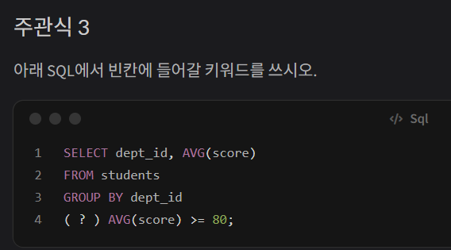
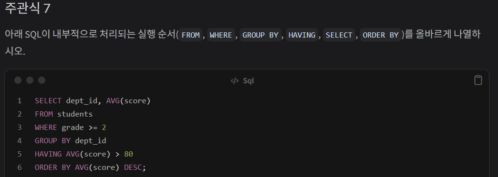

# 중간고사 

## 주관식 문제 — 사무자동화산업기사 수준 이론 10문제

### 주관식 1
SQL 명령어는 기능에 따라 DDL, DML, DCL로 분류된다. CREATE, SELECT, DROP, ALTER를 각각 해당 분류에 넣으시오

| 분류                                | 설명                                                 | 내용              |
| ----------------------------------- | ---------------------------------------------------- | ----------------- |
| **DDL**(Data Definition Language)   | 데이터베이스 구조(TABLE)를 정의,변경,삭제 할 때 사용 | CREATE,ALTER,DROP |
| **DML**(Data Manipulation Language) | 데이터(DATA)를 조회,삽입,수정,삭제할 때 사용         | SELECT            |
| **DCL**(Data Control Language)      | 데이터 접근 권한을 제어하거나 무결성을 유지합니다.   | 해당없음          |

### 주관식 2    
PRIMARY KEY의 특성 두 가지를 쓰시오

1.unique(유일성)
- 테이블 내의 모든 행에 대해 중복 값을 가질수없다.

2.Not Null(최소성)
- PRIMARY KEY 로 지정된 컬럼은 `NULL`값을 가질수없다.

### 주관식 3
아래 SQL에서 빈칸에 들어갈 키워드를 쓰시오.


정답: `HAVING`
이유: 조건을 사용할때 쓰는 키워드는 `where` 과 `having` 이 있는데
`where` 은 그룹화 전 개별에만 쓰고
`having` 은 그룹화된 결과에 사용한다


### 주관식 4
트랜잭션의 ACID 특성 4가지를 쓰고, 각각을 한 문장으로 설명하시오.

**원자성** 
- 트랜잭션 내의 모든 연산은 데이터 베이스에 모두 반영 되거나, 아니면 
전혀 반영 되지않아야 하는 특성이다.

**일관성**
- 트랜잭션 처리 전과 처리 후 데이터 모순이 없는 상태를 유지하는 것을 의미한다

**독립성**
- 트랜잭션을 수행 시 다른 트랜잭션의 연산 작업이 끼어들지 못하도록 보장하는 것을 의미한다

**지속성**
- 성공적으로 수행된 트랜잭션은 영원히 반영되어야 함을 의미한다

### 주관식 5
아래 SQL의 실행 결과로 COUNT(*)와 COUNT(score)에서 각각 어떤 값이 출력되는지 쓰고, 두 결과가 다른 이유를 설명하시오

```
score 컬럼 값: 85, NULL, 90, NULL, 75
SELECT COUNT(*), COUNT(score) FROM test_table;
```
(*) 은 NULL까지 포함하고 score 은 NULL을 포함하지 않아서
COUNT(*) 은 5
COUNT(score) 은 3이 표시된다


### 주관식 6
FOREIGN KEY 제약조건의 역할을 설명하고, FOREIGN KEY 컬럼에 NULL이 허용되는지 여부와 그 이유를 쓰시오

FOREIGN KEY 은 테이블간 관계 연결과 무결성 유지하는 역할을 하고
해당 컬럼에 NOT NULL 조건을 걸지 않는 이상 NULL 값이 허용되는데 
참조하는 행이 아직 정해지지 않았음을 나타내기 위해서이다.

### 주관식 7


FROM 으로 테이블을 정하고
WHERE 로 그룹화 하기 전 조건을 건 다음
GROUP BY 로 필터링 된 데이터만 묶어
HAVING 으로 그룹화 된 데이터를 다시 조건을 걸어주고
SELECT 으로 최종적으로 컬럼을 선택하여 AVG 를 내준다음
ORDER BY 로 정렬한다

### 주관식 8
아래 설명이 가리키는 데이터베이스 용어를 쓰시오.
```
릴레이션에서 튜플을 유일하게 식별할 수 있는 속성들의 집합으로, 유일성과 최소성을 모두 만족해야 한다.
```
기본키 (PRIMARY KEY) 가 위에서 언급했듯 유일성과 최소성을 만족시킨다

### 주관식 9
WHERE와 HAVING의 차이점을 GROUP BY 실행 순서와 연관지어 설명하시오

`WHERE` 은 그룹화 이전 개별화된 행을 먼저 골라내어 조건을 걸어
`AVG` 와 `SUM` 을 사용할수없고
`HAVING` 은 그룹화 된 결과 중 조건을 걸어 실행한다
`FROM`->`WHERE`(1차 필터링)->`GROUP BY`->`HAVING`(2차 필터링)->`SELECT`

### 주관식 10
GROUP BY 절을 사용할 때 SELECT 절에 올 수 있는 항목과 올 수 없는 항목을 구분하여 설명하시오

올수 있는 것
- GROUP BY 로 묶인 칼럼들
-  SUM,AVG 등 여러행을 하나로 요약하는 집계함수

올수 없는 것
- GROUP BY 로 묶이지않은 칼럼들